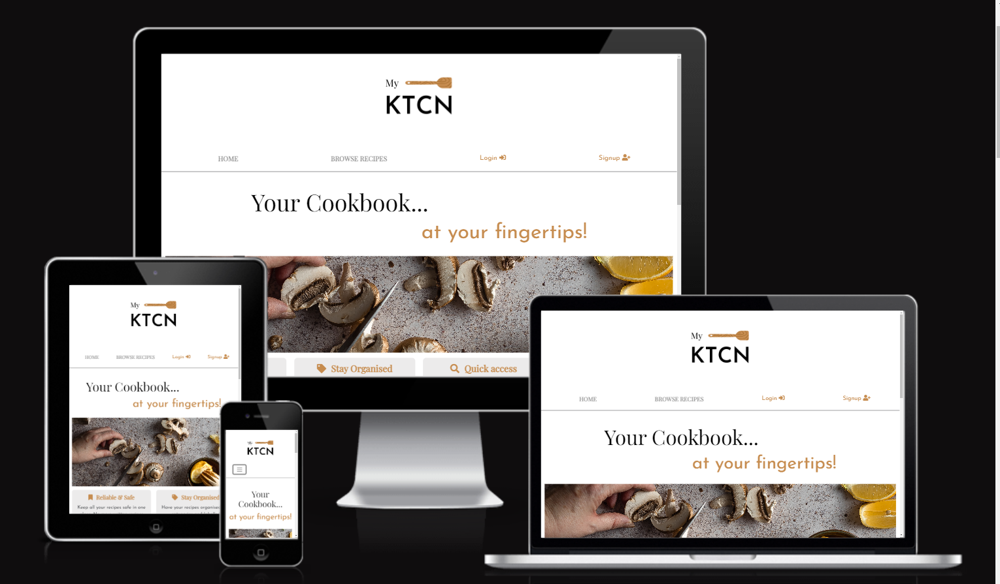
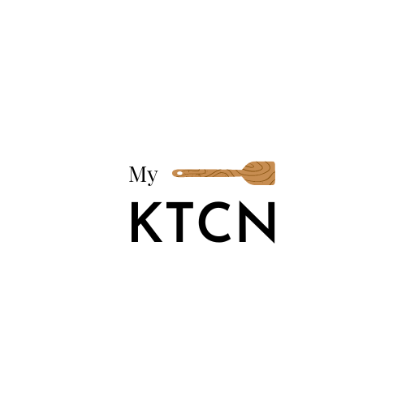
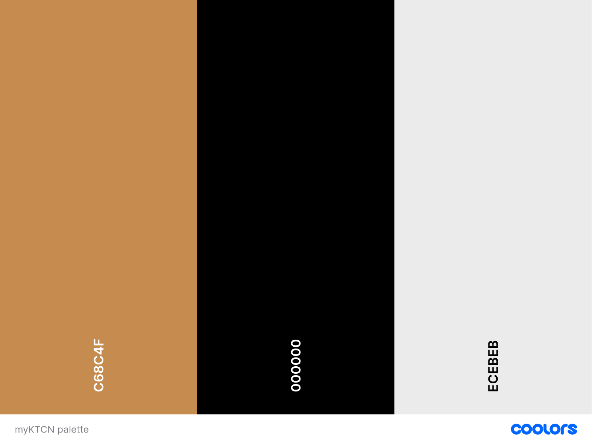

# myKTCN Cookbook

** Your personal Cookbook, in one app! **

[View the live website here](https://my-ktcn.herokuapp.com/)

## TABLE OF CONTENTS

1. [INTRODUCTION](#1-introduction)
2. [USER EXPERIENCE DESIGN](#2-user-experience-design)
   - [User stories](#user-stories)
   - [Business goals](#business-goals)
   - [Wireframes](#wireframes)
   - [Design](#design)
     - [Logo](#logo)
     - [Colors](#colors)
     - [Icons](#icons)
     - [Typography](#typography)
     - [Images](#images)
     - [Mockups](#mockups)
3. [FEATURES](#3-features)
   - [Existing features](#existing-features)
   - [Features to implement in the future](#features-to-implement-in-the-future)
4. [TESTING](#4-testing)
5. [TECHNOLOGIES USED](#5-technologies-used)
   - [Main languages used](#main-languages-used)
   - [Frameworks, Libraries and Programs used](#frameworks-libraries-and-programs-used)
6. [CREDITS](#6-credits)
7. [DEPLOYMENT](#7-deployment)
8. [ACKNOWLEDGEMENTS](#8-acknowledgements)
- - -
## 1. INTRODUCTION

myKTCN is a Django app created to provide users with a digital cookbook, accessible through an account registration, __to save their personal recipes, share them with the Community if wanted, and access other users' public recipes to get inspired__.

The app allows users to filter the recipes by category or title/ingredient, rate and comment other users' recipes. 

CRUD funtionality is fully implemented: recipes can be created, read, edited or deleted from the database.

This app has been created to showcase my Full Stack knowledge, along with my skills relating responsiveness, accessibility and UX Design.
- - - 
## 2. USER EXPERIENCE DESIGN

### USER STORIES

#### EPIC: ADMINISTRATION

- As a **Site Administrator**, I can **perform CRUD on the recipes and their comments** so that **I can manage the app content and keep it consistent and appropriate at all times**.

#### EPIC: USER PROFILE

- As a **Site User**, I can **create an account** so that **I can add, edit and delete recipes in my cookbook, choose which ones to share with the Community and interact with other users' recipes**.

- As a **Site User**, I can **login and logout from my account** so that **it stays secure**.

#### EPIC: APP NAVIGATION

- As a **Site User**, I can **immediately understand the website purpose** so that **I can decide if it meets my needs**.

- As a **Site User**, I can **easily and intuitively navigate the site** so that **I can find the desired content**.

- As a **Site User**, I can **view a paginated list of recipes** so that **I can choose and select the ones I am interested in**.

- As a **Site User**, I can **click on a recipe** so that **I can view the full details and comments**.

#### EPIC: COOKBOOK MANAGEMENT

- As a **Site User**, I can **create a new recipe** so that **it can be added to my Cookbook and, if wanted, shared with other users**.

- As a **Site User**, I can **edit and delete my recipes** so that **I can improve my Cookbook or remove the recipes that I no longer like and want to have in my arsenal**.

#### EPIC: RECIPE INTERACTION

- As a **Site User**, I can **rate other users' recipes** so that **I can leave a feedback about them**.

- As a **Site User**, I can **comment on the recipes other users have made public** so that **I can express my feedback about them**.

#### EPIC: UX IMPROVEMENTS

- As a **Site User**, I can **search through the recipes by category or name** so that **I can quickly locate the recipe I'm looking for**.

#### USER STORIES TO IMPLEMENT IN THE FUTURE

- As a **Site User**, I can **see the nutritional values of a recipe** so that **I can decide if it suits my current diet**.

- - - 
### BUSINESS GOALS

- - -
### WIREFRAMES

[See wireframes here]().

All wireframes were created with [Figma](https://www.figma.com/).

[Back to top ↑](README.md/#myktcn-cookbook)
- - - 
### DESIGN

- #### LOGO

myKTCN logo was created by me using [Canva](https://www.canva.com/).

- - - 
- #### COLORS

The palette was generated from the logo using [Coolors](https://coolors.co/).

- __#c68c4f (brownish color)__ has been used for most of the headings, buttons background, user actions in the navbar (login/signup/logout) and social icons in the footer.

- __black__ has been kept as the main color for most of the generic text so that a good background contrast is always present.

- __#ecebeb (greysh color)__ has been used as the backhround color for the cards and some page sections (to create some separation with the rest of the content).

- - -

- #### ICONS
  Icons were needed for the social media links, recipe specifications and buttons. They've all have been taken from [FontAwesome](https://fontawesome.com/).

- - - 
- #### TYPOGRAPHY

- For the headings, I wanted a font that was delicate but bold and that would attract attention without taking too much away from the rest of the text. So I choose __Playfair Display__ for these purposes.

- The font chosen for the body is __Josefin Sans__, inspired by geometric sans serif designs from the 1920s. It's an easy to read font and it pairs very well with Playfair Display.

All fonts have been imported in the project from [Google Fonts](https://fonts.google.com/).

- - - 
- #### IMAGES

The hero images that introduce the homepage, the browse recipes page and the cookbook page, have been taken from [Unsplash](https://unsplash.com) and uploaded on [Cloudinary](https://cloudinary.com/) as persistent file store.

- - - 
- #### MOCKUPS

After ideating the website structure and the wireframes, and after having decided on the design elements, I've created high-fidelity mockups of all of the pages to make tangible the idea in my mind and have a detailed guide to follow when coding.

[See mockups here](docs/README-images/mockups)

[Back to top ↑](README.md/#myktcn-cookbook)
- - - 
## 3. FEATURES

### EXISTING FEATURES

- - - 

### FEATURES TO IMPLEMENT IN THE FUTURE

[Back to top ↑](README.md/#myktcn-cookbook)
- - - 

## 4. TESTING

All of the information regarding the testing can be found [here](TESTING.md).

- - - 
## 5. TECHNOLOGIES USED

### Main languages used

### Frameworks, Libraries and Programs used

[Back to top ↑](README.md/#myktcn-cookbook)
- - - 

## 6. CREDITS

### Media

- - - 
### Code

- - - 
### Content

[Back to top ↑](README.md/#myktcn-cookbook)
- - - 
## 7. DEPLOYMENT

- - - 
### FORKING THE REPOSITORY

 1) In this project repository, locate the _Fork_ button on the top-right corner of the page and click on it. 

 2) Select an owner for the forked repository and give it a name (by default it will be named VAPIKA-Dosha-Quiz)

 3) Add a description of the repository if you want to

 4) Choose whether to copy only the default branch or all of the branches to the new fork (Only the default branch is copied by default)

 5) Click _Create fork_

 
- - -
### CLONING THE REPOSITORY

1) Locate the _<> Code_ button next to the _Gitpod_ button in this repository and click on it

2) Copy the URL for the repository

3) Open _Git Bash_ and select the location for the cloned directory

4) Paste the URL copied after typing _git clone_

5) After pressing _Enter_ you have your local clone

- - - 
## 8. ACKNOWLEDGEMENTS

This website was created for submission as the __Project Portfolio 4__ for the _Diploma in Full Stack Software Development_ with the [Code Institute](https://codeinstitute.net/). 

