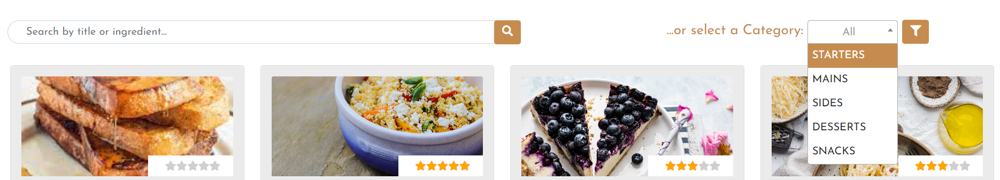
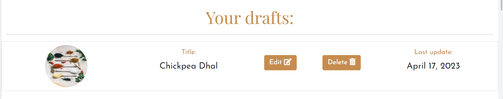

# myKTCN Cookbook

**Your personal Cookbook, in one app!**

[View the live website here](https://my-ktcn.herokuapp.com/)

## TABLE OF CONTENTS

1. [INTRODUCTION](#1-introduction)
2. [USER EXPERIENCE DESIGN](#2-user-experience-design)
   - [User stories](#user-stories)
   - [Project Management](#project-management)
   - [Database Schema](#database-schema---er-diagram)
   - [Wireframes](#wireframes)
   - [Design](#design)
     - [Logo](#logo)
     - [Colors](#colors)
     - [Icons](#icons)
     - [Typography](#typography)
     - [Images](#images)
     - [Mockups](#mockups)
3. [FEATURES](#3-features)
   - [Existing features](#existing-features)
   - [Features to implement in the future](#features-to-implement-in-the-future)
4. [TESTING](#4-testing)
5. [TECHNOLOGIES USED](#5-technologies-used)
   - [Main languages used](#main-languages-used)
   - [Frameworks, Libraries and Programs used](#frameworks-libraries-and-programs-used)
6. [CREDITS](#6-credits)
7. [DEPLOYMENT](#7-deployment)
8. [ACKNOWLEDGEMENTS](#8-acknowledgements)
- - -
## 1. INTRODUCTION

myKTCN is a Django app created to provide users with a digital cookbook, accessible through an account registration, __to save their personal recipes, share them with the Community if wanted, and access other users' public recipes to get inspired__.

The app allows users to filter the recipes by category or title/ingredient, rate and comment other users' recipes. 

CRUD funtionality is fully implemented: recipes can be created, read, edited or deleted from the database.

This app has been created to showcase my Full Stack knowledge, along with my skills relating responsiveness, accessibility and UX Design.
- - - 
## 2. USER EXPERIENCE DESIGN

### USER STORIES

#### EPIC: ADMINISTRATION

- As a **Site Administrator**, I can **perform CRUD on the recipes and their comments** so that **I can manage the app content and keep it consistent and appropriate at all times**.

#### EPIC: USER PROFILE

- As a **Site User**, I can **create an account** so that **I can add, edit and delete recipes in my cookbook, choose which ones to share with the Community and interact with other users' recipes**.

- As a **Site User**, I can **login and logout from my account** so that **it stays secure**.

#### EPIC: APP NAVIGATION

- As a **Site User**, I can **immediately understand the website purpose** so that **I can decide if it meets my needs**.

- As a **Site User**, I can **easily and intuitively navigate the site** so that **I can find the desired content**.

- As a **Site User**, I can **view a paginated list of recipes** so that **I can choose and select the ones I am interested in**.

- As a **Site User**, I can **click on a recipe** so that **I can view the full details and comments**.

#### EPIC: COOKBOOK MANAGEMENT

- As a **Site User**, I can **create a new recipe** so that **it can be added to my Cookbook and, if wanted, shared with other users**.

- As a **Site User**, I can **edit and delete my recipes** so that **I can improve my Cookbook or remove the recipes that I no longer like and want to have in my arsenal**.

#### EPIC: RECIPE INTERACTION

- As a **Site User**, I can **rate other users' recipes** so that **I can leave a feedback about them**.

- As a **Site User**, I can **comment on the recipes other users have made public** so that **I can express my feedback about them**.

#### EPIC: UX IMPROVEMENTS

- As a **Site User**, I can **search through the recipes by category or name** so that **I can quickly locate the recipe I'm looking for**.

#### USER STORIES TO IMPLEMENT IN THE FUTURE

- As a **Site User**, I can **see the nutritional values of a recipe** so that **I can decide if it suits my current diet**.

- - -
### PROJECT MANAGEMENT
Agile practices have been followed throughout the development of myKTCN and the GitHub __Project Board__ has been particularly useful to do so. 
Each User Stories was created as an Issue on the Github repository for this project, then added to the "To do" section of the Project Board, moved to the "In progress" while working on it, and ultimately moved on the "Done" section once the feature was fully implemented.

[Visit the project board here](https://github.com/users/lestece/projects/4)

[See User Stories as Issues](https://github.com/lestece/myKTCN/issues?q=is%3Aissue+is%3Aclosed)

- - - 
### DATABASE SCHEMA - ER DIAGRAM

The database models and fields were planned and outlined using an ER Diagram in [Lucidchart](https://lucid.co/).

The creation of the diagram was vital to understand how the models relate to each other:

- User: Django allAuth was used for dealing with the registration, management and authentication of the user model.
A specific user can be the creator of zero or many recipes, comments and ratings but one specific recipe, comment or rating can belong to one (and one only) user.

- Recipe: a recipe can have zero or many comments, and zero or many ratings.

- Comment: a specific comment can belong to one (and one only) recipe.

- Rating: a certain rating is related to one (and one only) recipe.
- - - 
### WIREFRAMES

[See wireframes here](docs/README-images/wireframes).

All wireframes were created with [Figma](https://www.figma.com/).

[Back to top ↑](README.md/#myktcn-cookbook)
- - - 
### DESIGN

- #### LOGO

myKTCN logo was created by me using [Canva](https://www.canva.com/).
I wanted to create an engaging logo that immediately conveys the app purpose, with simple colors and a "fun" feel.
If clicked, it redirects to the homepage of the website.

- - - 
- #### COLORS

The palette was generated from the logo using [Coolors](https://coolors.co/).

- __#c68c4f (brownish color)__ has been used for most of the headings, buttons background, user actions in the navbar (login/signup/logout) and social icons in the footer.

- __black__ has been kept as the main color for most of the generic text so that a good background contrast is always present.

- __#ecebeb (greysh color)__ has been used as the background color for the cards and some page sections (to create some separation with the rest of the content).

- - -

- #### ICONS
  Icons were needed for the social media links, recipe specifications and buttons. They've all have been taken from [FontAwesome](https://fontawesome.com/).

- - - 
- #### TYPOGRAPHY

- For the headings, I wanted a font that was delicate but bold and that would attract attention without taking too much away from the rest of the text. So I choose __Playfair Display__ for these purposes.

- The font chosen for the body is __Josefin Sans__, inspired by geometric sans serif designs from the 1920s. It's an easy to read font and it pairs very well with Playfair Display.

All fonts have been imported in the project from [Google Fonts](https://fonts.google.com/).

- - - 
- #### IMAGES

The hero images that introduce the homepage, the browse recipes page and the cookbook page, have been taken from [Unsplash](https://unsplash.com) and uploaded on [Cloudinary](https://cloudinary.com/) as persistent file store.

- - - 
- #### MOCKUPS

After ideating the website structure and the wireframes, and after having decided on the design elements, I've created high-fidelity mockups of all of the pages to make tangible the idea in my mind and have a detailed guide to follow when coding.

[See mockups here](docs/README-images/mockups)

[Back to top ↑](README.md/#myktcn-cookbook)
- - - 
## 3. FEATURES

### EXISTING FEATURES

#### - __NAVBAR__
myKTCN navbar is fully responsive and allows an intuitive site navigation.
Depending on the user state, it displays different navigation links: 
- __Logged out / Signed out user:__

If the user is not logged in or doesn't still have an account, the navbar is the first call to action to login into the account or register one. It allows limited access to the "Browse recipes" page where registered users can share their recipes with the world.

- __Logged in user:__

When a user is logged in, the navbar displays the whole range of functionalities available to registered users:
access to the personal Cookbook and to the recipes from the Community in the main navigation bar, and access to the user's drafts page, a quick link to create a new recipe and a logout button through the dropdown menu that opens under the user profile.

- __Hamburger Menu for medium / small screen sizes:__

Being fully responsive, the navigation bar shrinks to an hamburger menu when the screen size is below 768px.
As for larger screen sizes, the toggled hamburger menu shows different navigation links based on the user state.
- - - 
#### - __HOMEPAGE__
The homepage is showed for users that are not logged in or yet registered: it showcases the perks of using the app in a catchy and informative way.

- __Hero content and features cards__

The hero section contains a concise introduction of the app main purpose and an image that wants to convey the feel of homecooked meals. It's then followed by a section that, through cards, showcases the perks and functionalities of using the app: it's aimed to convey trustworthiness and inimitability, leaving the users with the feeling that they need to create an account and use the app.

- __Browse recipes section__

The browse recipes section is a preview of the Browse recipes page and ends with a button that links to that page of the app. It shows the last four recipes that have been shared in the Community and, under 768px, mutates into a carousel with controls.

- __Call to action__

After presenting the users with all the previous information, the last section of the homepage is a CTA containing a button to register an account with myKTCN.
- - - 
#### - __FOOTER__

myKTCN footer contains links to the social accounts (that open on a new page) and the app Copyright.
- - -
#### - __RECIPE FILTERING__

Both in the Browse recipes page and user's personal Cookbook, recipes can be filtered by title or ingredient in a search bar, or by category selectable in a dropdown menu.
- - -
#### - __RECIPES DISPLAY IN BROWSE RECIPES PAGE__

In the browse recipes page, each recipe is displayed through a Bootstrap card that shows its image, average rating, title, a preview of the description, the total preparation time, its cost and level of difficulty. Each card is a link to the full recipe details page.

On large screen sizes, four recipes are displayed one after the other horizontally, to then become two on medium screens, and on smaller screen sizes each recipe occupies the full width.
- - -
#### - __COOKBOOK PAGE__

The user's cookbook page shows the personal recipes through Bootstrap cards that display the recipe's image, category, title, description preview and date of creation.

Each recipe card is a link to the full recipe details page.

A button to create a new recipe is shown before the cards.

For consistency, the same layout used in the browse recipes page was used: four recipes displayed together horizontally for large screens, two for medium ones, and one individual recipe card occupying the full width of the screen for smaller sizes.
- - -
#### - __USER'S DRAFTS__

Users can access the drafts page through the dropdown menu that opens on clicking on the user profile in the navbar.
This page contains all of the recipes that have been started to be created, but saved as "draft" because incomplete. Each draft block shows the recipe image, its title, a button to edit the recipe (that links to the "create recipe" form prefilled with the recipe data already existing in the database), a delete button to eliminate the recipe completely, and the date the recipe was last worked on.
- - -
#### - __ADD RECIPE FORM__

The form to create a new recipe is intuitive and easy to fill in. Users are required to insert the title, description, ingredients and method (these last two fields allow users to automatically have their inputs transformed into a list if the button at the top of the textarea is selected), an image (if none is uploaded, a placeholder image is provided), preparation time and cooking time in minutes, number of servings. They are also requested to select the level of difficulty, recipe cost, category. In the end they're asked if they want their recipe to be saved in their cookbook or as a draft, and if they want to make it available to the Community in the browse recipes page.
- - - 
#### - __RECIPE DETAILS PAGE__

The recipe details page is displayed in a layout that wants to avoid crowded information and be as neat and organized as possible.-Recipe header: it contains the recipe specifics necessary for the user to understand if that recipe is what he/she was looking for. It displays the recipe image, it's title and category, date of creation, preparation and cooking times, number of servings, cost and difficulty.

-Recipe description: this section gives extra information about that recipe in the form of a description.

-Recipe in action: finally, the practical part of the recipe is shown. Ingredients and method blocks are displayed next to each other (or one after the other in the case of smaller screen sizes). Each ingredient and step is displayed in a list for easy readability and appearance.

-Recipe comments: the end of the page shows the list of comments that have been posted for that recipe by users (if there's any).
- - -
#### - __EDIT/DELETE RECIPE__

In the recipe details page for a specific recipe, if the user is logged in and the author of that particular recipe, a button for editing and one for deleting the recipe are available under the recipe description.
- - -
#### - __RATE RECIPE__

Under the recipe description in the recipe details page, when a user is logged in and not the author of that specific recipe, a rating system is available.
- - -
#### - __RECIPE COMMENTING__

In the recipe comments section on the recipe details page, a comment form is made available to users who are logged in and not the author of that particular recipe.
The comment needs to be approved by the admin before publication to maintain the site content safe and respectful.
- - -
#### - __USER SIGN UP, LOGIN AND LOGOUT__

[Django allAuth](https://django-allauth.readthedocs.io/en/latest/) was used for myKTCN to handle user accounts. The basic templates have been customized to fit the app and simplified so that upon registration, username, email and password are required to create an account, to login in only username and password are asked for, and to logout a confirmation of the action is required.
- - - 
### FEATURES TO IMPLEMENT IN THE FUTURE
- A section in the recipe details page that shows the nutritional values for that specific recipes.
- More recipes filtering options to aid navigation when the browse recipe page or the personal cookbook get populated with a large amount of recipes.
- Implementing the password retrieving with Django allAuth
- Implementing Django allAuth registration/logging in using social network accounts

[Back to top ↑](README.md/#myktcn-cookbook)
- - - 

## 4. TESTING

All of the information regarding the testing can be found [here](TESTING.md).

- - - 
## 5. TECHNOLOGIES USED

### Main languages used
- HTML
- CSS
- JavaScript
- Python

### Frameworks, Libraries and Programs used
- [Django](https://www.djangoproject.com/): used as main Python framework for this project
- [Django-allauth](https://django-allauth.readthedocs.io/en/latest/): authentication library used for creating and managing user accounts
- [Bootstrap5](https://getbootstrap.com/docs/5.0/getting-started/introduction/): CSS framework used in the templates to make the app responsive and to use a mobile-first approach
- [Django-crispyforms](https://django-crispy-forms.readthedocs.io/en/latest/): used to manage the Django forms in the app
- [Django-filter](https://django-filter.readthedocs.io/en/stable/): used to implement the filter by category functionality
- [Django-Summernote](https://github.com/summernote/django-summernote): to implement the Summernote editor in the ingredients and method fields of the recipe forms
- [Select2](https://select2.org/): JQuery replacement used for the category filter select boxes
- [ElephantSQL](https://www.elephantsql.com/): PostgreSQL used as the database for myKTCN
- [Cloudinary](https://cloudinary.com/): used to host all the images 
- [Heroku](https://heroku.com/): Cloud platform used to host the app
- [GitPod](https://gitpod.io): used for writing this website code, committing and pushing to GitHub.
- [GitHub](https://github.com/): used for hosting, storing, deploying the project and for an agile development.
- [Figma](https://www.figma.com/): used for designing the wireframes and mockups for the website in the first phase of the development process
- [Lucidchart](https://www.lucidchart.com/pages/): used to create the ER diagram for the database
- [Chrome Dev Tools](https://developer.chrome.com/docs/devtools/): used throughout the development and for testing responsiveness and lighthouse scores
- [Coolors](https://coolors.co/): to generate the color palette from the logo created for this app
- [Canva](https://www.canva.com/): for creating the website logo
- [Google Fonts](https://fonts.google.com/): used for importing the fonts for this  website ("Josefin Sans" and "Playfair Display") into the project
- [FontAwesome](https://fontawesome.com/): used for the social media icons
- [Flaticon.com](https://www.flaticon.com/): used for the title bar icon
- [Icoconverter.com](https://www.icoconverter.com/): used for converting the title bar icon into the .ico format
- [GifCap (by João Moreno)](https://gifcap.dev/): used for creating the gifs from the screen recordings during the testing process (for the TESTING.md) and for this README file. 
- [AmIResponsive](https://ui.dev/amiresponsive): used for capturing a screenshot of how the website look on different screen sizes (screenshot that introduces this README file) 
- [TinyPNG](https://tinypng.com/): used for compressing and optimizing the logo, hero images and the image placeholder for the recipes
- [beFunky](https://www.befunky.com/features/resize-image/): used for resizing the hero images and the image placeholder for the recipes
- [Convertio](https://convertio.co/it/jpg-webp/): used for converting the logo, hero images and the image placeholder for the recipes to the webp format
- [W3C HTML validator](https://validator.w3.org/): used for validating the HTML code
- [Jigsaw CSS validator](https://jigsaw.w3.org/css-validator/): used for validating the CSS code
- [JSHint validator](https://jshint.com/): used for validating the JavaScript code
- [CI Python Linter Validator](https://pep8ci.herokuapp.com/): used for validating the Python code

[Back to top ↑](README.md/#myktcn-cookbook)
- - - 

## 6. CREDITS

### Media

The images used for the hero sections in the homepage, browse recipes page and the cookbook page, and the image used as placeholder image for the recipes, were sourced from [Unsplash](https://unsplash.com/).

- - - 
### Code

- [Django docs] (https://docs.djangoproject.com/en/4.2/) was used for the development of the whole Django app

- [Bootstrap docs](https://getbootstrap.com/docs/5.0/getting-started/introduction/) and particularly [this](https://getbootstrap.com/docs/4.0/components/carousel/) for the implementation of the carousel with controls for small screens in the homepage

- [Medium website] (https://medium.com/) has been particularly useful for the implementation of various functionalities used in myKTCN app:
   - the __search bar__ used to filter recipes by title or ingredient was implemented thanks to the article at [this link](https://stackpython.medium.com/django-search-with-q-objects-tutorial-9c701db74e0e) 
   - the __category filter__ for filtering recipes by category was implemented following the instructions at [this link](https://medium.com/@balt1794/chapter-15-django-filters-6947da6df52a).
   - the __star rating__ system was successfully implemented thanks to [this tutorial](https://medium.com/geekculture/django-implementing-star-rating-e1deff03bb1c)
   - [this article](https://levelup.gitconnected.com/django-customize-404-error-page-72c6b6277317) has helped me writing the 404 custom page for the app

- For creating the generic editing view, the [Django generic editing views docs](https://docs.djangoproject.com/en/4.1/ref/class-based-views/generic-editing/#django.views.generic.edit) and [CodingEntrepreneurs](https://www.youtube.com/@CodingEntrepreneurs) YouTube Channel at [this](https://www.youtube.com/watch?v=KB_wDXBwhUA) and [this](https://www.youtube.com/watch?v=a718ii0Lf6M) link were extremely helpful.

- [StackOverflow](https://stackoverflow.com/) was particularly helpful in multiple occasions when I didn't know how to implement specific features/the official documentation wasn't clear enough/bugs were encountered.
While writing the DeleteView, for example, [this post](https://stackoverflow.com/questions/24822509/success-message-in-deleteview-not-shown) has helped me fix the success message not showing due to the fact that SuccessMessageMixin can't be used with DeleteView.

- [Code Institute](https://codeinstitute.net/) walkthrough project "I think, therefore I blog" for the pagination, displaying messages and setting up and deploying the whole app
- - - 
### Content

The recipes created by me have been sourced from different websites on the web, including [BBC Good Food](https://www.bbcgoodfood.com/recipes) and [Giallozafferano](https://www.giallozafferano.com/).

[Back to top ↑](README.md/#myktcn-cookbook)
- - - 
## 7. DEPLOYMENT

- - - 
### FORKING THE REPOSITORY

 1) In this project repository, locate the _Fork_ button on the top-right corner of the page and click on it. 

 2) Select an owner for the forked repository and give it a name (by default it will be named VAPIKA-Dosha-Quiz)

 3) Add a description of the repository if you want to

 4) Choose whether to copy only the default branch or all of the branches to the new fork (Only the default branch is copied by default)

 5) Click _Create fork_

 
- - -
### CLONING THE REPOSITORY

1) Locate the _<> Code_ button next to the _Gitpod_ button in this repository and click on it

2) Copy the URL for the repository

3) Open _Git Bash_ and select the location for the cloned directory

4) Paste the URL copied after typing _git clone_

5) After pressing _Enter_ you have your local clone

- - - 
## 8. ACKNOWLEDGEMENTS

This website was created for submission as the __Project Portfolio 4__ for the _Diploma in Full Stack Software Development_ with the [Code Institute](https://codeinstitute.net/). 

