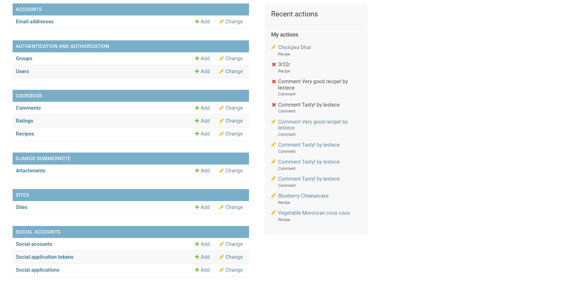
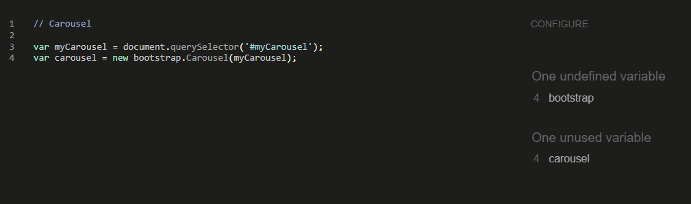

# myKTCN app Testing

## TABLE OF CONTENTS

1) [Manual Testing](#1-manual-testing)
    - [Navigation](TESTING.md/#navigation)
    - [Homepage](TESTING.md/#homepage)
    - [Browse recipes](TESTING.md/#browse-recipes)
    - [Login page](TESTING.md/#login-page)
    - [Sign up page](TESTING.md/#signup-page)
    - [Logout page](TESTING.md/#logout-page)
    - [Cookbook](TESTING.md/#cookbook)
    - [Recipe details page](TESTING.md/#recipe-details)
    - [Drafts page](TESTING.md/#drafts)
    - [Add recipe page](TESTING.md/#add-recipe)
    - [Edit recipe page](TESTING.md/#edit-recipe)
    - [Delete recipe page](TESTING.md/#delete-recipe)
    - [404 page](TESTING.md/#404-page)
    - [Admin panel](TESTING.md/#admin-panel)
2) [Code Validation](#2-code-validation)
    - [W3C HTML Validation](TESTING.md/#w3c-html-validation)
    - [W3C (Jigsaw) CSS Validation](TESTING.md/#jigsaw-css-validation)
    - [JSHint JavaScript Validation](TESTING.md/#jshint-javascript-validation)
    - [CI Python Linter Python Validation](TESTING.md/#ci-python-linter-python-validation)
3) [Responsiveness testing](TESTING.md/#3-responsiveness-testing)
    - [Homepage responsiveness](TESTING.md/#homepage-responsiveness)
    - [Browse recipes responsiveness](TESTING.md/#browse-recipes-responsiveness)
    - [Cookbook responsiveness](TESTING.md/#cookbook-responsiveness)
    - [Recipe form responsiveness](TESTING.md/#recipe-form-responsiveness)
    - [Drafts page responsiveness](TESTING.md/#drafts-responsiveness)
    - [Recipe form responsiveness](TESTING.md/#recipe-form-responsiveness)
4) [Browser compatibility](TESTING.md/#4-browser-compatibility)
5) [Bugs and fixes](TESTING.md/#5-bugs-and-fixes)
6) [Lighthouse reports](TESTING.md/#6-ligthouse-reports)
7) [User testing](TESTING.md/#7-user-testing)

[⬅ Back to the README.md file](README.md)

- - -
## 1) MANUAL TESTING

myKTCN has been thoroughly manually tested to make sure that the app works as intended. The tests are reported in the tables below and the related screen recordings [can be found here](docs/TESTING-images/manual-testing).

### NAVIGATION
| Element     | Expectation        | Test Result  |
| ------------- | ------------- |---------------|
| Navbar links | Link to the correct pages | Pass | 
| Footer  | Social links open in a new tab | Pass |           

### HOMEPAGE 
| Element     | Expectation        | Test Result  |
| ------------- | ------------- |---------------|
| Page  | Not visible when user logs in/signs up  | Pass |
| 'Browse all" button | Links to the browse recipes page| Pass | 
| 'Sign up' button  | Links to the Sign Up page | Pass |
| Carousel for small screens  | Shows the latest 4 added recipes, slides automatically and controls work | Pass |

### BROWSE RECIPES
| Element     | Expectation        | Test Result  |
| ------------- | ------------- |---------------|
| Search bar  | Returns the recipes containing the inputted ingredient in the title or ingredients list. Empty result if there's no match.  | Pass |
| Category filter | Returns the recipes that belong in the selected category| Pass | 
| Recipe cards  | Shows average rating | Pass |
| Recipe cards  | On click, they link to the related recipe details page | Pass |

### LOGIN PAGE
| Element     | Expectation        | Test Result  |
| ------------- | ------------- |---------------|
| Form  | Invalid input data is handled  | Pass |
| Form | Valid input data logs the user in| Pass | 
| 'Remember me' checkbox  | When selected, the user is not logged out after inactivity | Pass |
| 'Log me in' button  | Based on valid or invalid form data, on click it either logs the user in or asks for valid data insertion | Pass |

### SIGNUP PAGE
| Element     | Expectation        | Test Result  |
| ------------- | ------------- |---------------|
| Form  | Invalid input data is handled  | Pass |
| Form | Valid input data logs the user in| Pass | 
| 'Remember me' checkbox  | When selected, the user is not logged out after inactivity | Pass |
| 'Sign up' button  | Based on valid or invalid form data, on click it either registers the user or asks for valid data insertion | Pass |

### LOGOUT PAGE
| Element     | Expectation        | Test Result  |
| ------------- | ------------- |---------------|
| Confirm logout button  | On click, the user is logged out and notifies user about it  | Pass |

### COOKBOOK
| Element     | Expectation        | Test Result  |
| ------------- | ------------- |---------------|
| Search bar  | Returns the user's recipes containing the inputted ingredient in the title or ingredients list. Empty result if there's no match.  | Pass |
| Category filter | Returns the user's recipes that belong in the selected category| Pass |
| Recipe cards  | On click, they link to the related recipe details page | Pass |

### RECIPE DETAILS
| Element     | Expectation        | Test Result  |
| ------------- | ------------- |---------------|
| Avg rating  | The avg rating for the recipe in question is showed and correct  | Pass |
| Edit btn - user is the author | If user is the author, the edit btn is showed and links to the edit recipe page  | Pass |
| Delete btn - user is the author | If user is the author, the delete btn is showed and links to the edit recipe page  | Pass |
| Rating system | If user is not the author, the rating system is showed and works as intended | Pass |
| Comment form | If user is logged in, the comment form is showed and upon submission it notifies that it will be posted after admin approval. | Pass |
| Comment section | Shows the approved comments for the recipe. | Pass |

### DRAFTS
| Element     | Expectation        | Test Result  |
| ------------- | ------------- |---------------|
| Edit button  | On click, it redirects to the edit recipe page  | Pass |
| Delete button  | On click, it redirects to the delete recipe confirmation page  | Pass |

### ADD RECIPE
| Element     | Expectation        | Test Result  |
| ------------- | ------------- |---------------|
| Form  | All fields are required except for the image  | Pass |
| Image field  | Correctly uploads the user selected image for the recipe | Pass |
| Ingredients field  | Shows the Summernote widget to insert ingredients as a list | Pass |
| Method field  | Shows the Summernote widget to insert the steps as a list | Pass |
| Select fields  | Choices are selectable | Pass |
| Recipe draft  | Is user choses to save as 'draft', the recipe is saved in the user's drafts page | Pass |
| Recipe published | If user choses to save as 'published', the recipe is saved in the user's cookbook page | Pass |
| Recipe shared  | If user checks the 'share with the Community' box, the recipe is made available to everybody in the browse recipes page  | Pass |
| Create recipe btn  | Correctly saves the recipe and redirects to the recipe details page or draft page based on user choice | Pass |

### EDIT RECIPE
| Element     | Expectation        | Test Result  |
| ------------- | ------------- |---------------|
| Form  | All fields are prefilled with the previous recipe details  | Pass |
| Image field  | Correctly uploads the user selected image for the recipe | Pass |
| Ingredients field  | Shows the Summernote widget to insert ingredients as a list | Pass |
| Method field  | Shows the Summernote widget to insert the steps as a list | Pass |
| Select fields  | Choices are selectable | Pass |
| Recipe draft  | Is user choses to save as 'draft', the recipe is saved in the user's drafts page | Pass |
| Recipe published | If user choses to save as 'published', the recipe is saved in the user's cookbook page | Pass |
| Recipe shared  | If user checks the 'share with the Community' box, the recipe is made available to everybody in the browse recipes page  | Pass |
| Edit recipe btn  | Correctly saves the recipe with the edited information and redirects to the recipe details page or draft page based on user choice | Pass |

### DELETE RECIPE
| Element     | Expectation        | Test Result  |
| ------------- | ------------- |---------------|
| Confirm button  | On click, the recipe is successfully deleted from the database  | Pass |

### 404 PAGE
| Element     | Expectation        | Test Result  |
| ------------- | ------------- |---------------|
| Back to home btn  | On click, it redirects to the homepage | Pass |

- - - 
### ADMIN PANEL

- The Recipe, Comment and Rating models are successfully registered in the admin panel.

- Admins have full control over the recipes, being able to create/edit and/or delete them.

- Admins also have full control over the comments so that the app content is kept safe and respectful at all times. For improved functionality, comments can also be approved or deleted from the general comments.

- Each single rating is successfully recorded in the database. This has been particularly helpful to test that the average rating for each recipe was being calculated correctly.

- Django allauth works successfully and the admins can change users permissions.

[Back to top ↑](TESTING.md/#myktcn-app-testing)
- - -

## 2) CODE VALIDATION
### W3C HTML VALIDATION

All html pages have been run through the [W3C HTML Validator](https://validator.w3.org/) and the below results were returned.

| HTML page     | Errors        | Warnings      | See results  |
| ------------- | ------------- |---------------|--------------|
| base.html     | None          | None          | 

base results
  
|
| index.html    | None          | None          |

index results
  
|
| browse_recipes.html    | None          | None          |

browse recipes results
  
|
| cookbook.html    | None          | None          |

cookbook results
  
|
| recipe_create.html    | **Yes**         | None          |

Add recipe results
  
|
| recipe_edit.html    | **Yes**         | None          |

Edit recipe results
  
|
| recipe_confirm_delete.html    | None          | None          |

Delete recipe results
  
|
| recipe_details.html    | None          | None          |

recipe details results
  
|
| drafts.html    | None          | None          |

drafts results
  
|
| 404.html    | None          | None          |

404 page results
  
|
| login.html    | None          | None          |

login results
  
|
| logout.html    | None          | None          |

logout results
  
|
| signup.html    | None          | None          |

signup results
  
|

As indicated in the table, there are two pages that return validation errors: __recipe_create.html__ and __recipe_edit.html__. These errors come from the installed Summernote library, that runs on the ingredients and method input fields in the recipe form. These errors stay __unresolved/cannot be fixed__ since they come from an external source.
- - - 
### Jigsaw CSS VALIDATION

__No errors or warnings__ are returned when passing the styles.css through the [Jigsaw CSS Validator](https://jigsaw.w3.org/css-validator/).

- - -
### JSHint JavaScript VALIDATION

All the sripts used in myKTCN have been run through the [JSHint Javascript Validator](https://jshint.com/) and they return __no errors__.

| Script     | Errors        | See results  |
| ------------- | -------------|--------------|
| carousel     | None          | 

carousel script results
  
|
| messages display     | None          | 

display messages script results
  
|
| rating system     | None          | 

rating system script results
  
|
| select2     | None          | 

select2 script results
  
|

- - -
### CI Python Linter Python VALIDATION

All the main Python files were run through the [CI Python Linter Validator](https://pep8ci.herokuapp.com/) with __no errors__ returned.

| Python file     | Errors        | See results  |
| ------------- | -------------|--------------|
| forms.py     | None          | 

forms.py results
  
|
| models.py     | None          | 

models.py results
  
|
| urls.py     | None          | 

urls.py results
  
|
| views.py     | None          | 

views.py results
  
|

[Back to top ↑](TESTING.md/#myktcn-app-testing)
- - -
## 3) RESPONSIVENESS TESTING 
All of the website pages are fully responsive.

The responsiveness testing has been conducted using [Google Chrome Developer Tools](https://developer.chrome.com/docs/devtools/), both on the devices available and on "responsive" modality.

### HOMEPAGE RESPONSIVENESS

### BROWSE RECIPES RESPONSIVENESS

### COOKBOOK RESPONSIVENESS

### DRAFTS RESPONSIVENESS

### RECIPE FORM RESPONSIVENESS

[Back to top ↑](TESTING.md/#myktcn-app-testing)
- - - 
## 4) BROWSER COMPATIBILITY

myKTCN has been tested for browser compatibility on:

- Google Chrome

- Firefox

- Microsoft Edge

- Opera

[Back to top ↑](TESTING.md/#myktcn-app-testing)
- - - 
## 5) BUGS AND FIXES

All bugs found during the development and testing of myKTCN app are reported below alongside their fixes.

### Bug 1 - USER DRAFTS URL
Clicking on "drafts" in the user account dowpdown menu, the link would display a page error: __http protocol error__. By inspecting the page, in the network section of the developer tools, the requested path showed that there was an error in the django templating: __closing % was missing in the tag. Fixed by adding it__ and the link started working correctly.

### Bug 2 - CREATE RECIPE / DRAFT SHOWS 404 ERROR UPON SUBMISSION
When creating a new recipe, a 404 error was displayed. The path was indicating a correct recipe slug, and checking the database from the admin panel it was obvious that the recipe had automatically being added to the records. I realized the error was coming from the fact that __the recipe was created as draft: since only recipes with a status of 1 (published) are filtered when requesting a recipe details page, and the success url for creating a new recipe was redirecting all of the recipes (even the ones with status 0 - draft) to a recipe detail page, I realized I had to redirect the recipes that are being created as drafts to a different url (the user draft page)__. So the original get_absolute_url in the Recipe model has been overwritten using a get_success_url that checks the recipe status and redirects to the recipe detail page if the recipe is saved as published, or the user drafts page if saved as draft.

### Bug 3 - ANONYMOUS USER ERROR WHEN A NOT LOGGED IN USER CLICKS ON A RECIPE CARD FOR VIEWING THE RECIPE DETAILS PAGE
The error was coming from the view: __ratings for the logged in user on a specific recipe where being filtered without checking if the user was logged in__. Fixed by adding an if statement that filters the rating for that user only if it's a logged in user.

### Bug 4 - LOGIN REDIRECTING TO INDEX.HTML
After login a user was being redirected to the homepage (which is designed for new users only and not for existing ones). The logged in user is supposed to be redirected to the cookbook instead. __Fixed by changing the LOGIN_REDIRECT_URL in the settings.py file to the Cookbook url__

### Bug 5 - PAGINATION NOT WORKING
The error was coming from the fact that, inside of the ListView for browsing recipes, user cookbook and user drafts, I was rewriting the get method and the pagination wasn't being passed to the context. __Fixed by adding the filters into the get_queryset and passing the context into the template for searched recipe (through the search bar) and the form for filtering through category using get_context_data__. These article have been very useful for understanding where the issue was:
-https://stackoverflow.com/questions/59870121/django-listview-is-not-paginating-despite-paginate-by-being-set
-https://stackoverflow.com/questions/64618631/how-to-filter-and-paginate-in-listview-django

### Bug 6 - DJANGO MODEL FORM NOT UPLOADING IMAGE
When adding or editing a recipe, the image upload wouldn't work (no error was given, but the image field was the only one not being saved). It was only working if the image was being uploaded through the admin panel. __Fixed by adding enctype='multipart/form-data'__. This link was very useful to understand and fix the issue:
(https://stackoverflow.com/questions/29171077/imagefield-not-saving-images-in-modelform-django-python)

### Bug 7 - SEARCH BAR IN COOKBOOK BUG
While testing the cookbook page, a bug related to the search bar was found: __upon search, the results returned were redirecting to the 'browse recipes' page and retrieving recipes that didn't belong to the logged in user__. The error was found in the 'cookbook' template: the action for the search bar form was set as the url for the browse recipes page. __Fixed by changing the url to the cookbook one__.

[Back to top ↑](TESTING.md/#myktcn-app-testing)
- - - 
## 6) LIGHTHOUSE REPORTS

All of myKTCN app pages have been tested for Performance, Accessibility, Best Practices and SEO using [Lighthouse Chrome Developer Tool](https://developer.chrome.com/docs/lighthouse/overview/).

Results are reported in the table below and we can notice that the scores are not ideal, particularly regarding Performance.
I improved the scores by optimizing, resizing and converting the images uploaded to Cloudinary to the webp format, but I couldn't better them further: the main factor for them is load time, and since the site loads on Heroku, gets the images from Cloudinary (users also may upload images in formats that are not web friendly/sized properly) and gets the database information from ElephantSQL, there really isn't much that can be done to improve the scores further.

| Page     | Performance (D-M)  | Accessibility (D-M)   | Best Practices (D-M)  | SEO (D-M)  | Desktop results |Mobile results |
| ------------- | -------------|--------------|--------------|--------------|--------------|--------------|
| __homepage__ |  82-62  |   92-92  |  100-100   | 90-92   | 

click
  
|

click
  
 |
| __browse_recipes__ - logged out user |  53-49  |   89-88  |  100-100   | 90-89   | 

click
  
|

click
  
 |
| __browse_recipes__ - logged in user |  52-49  |   89-88  |  100-100   | 90-89   | 

click
  
|

click
  
 |
| __cookbook__ |  75-65  |   89-88  |  100-100   | 90-89   | 

click
  
|

click
  
 |
| __drafts__ |  71-64  |   95-94  |  92-92   | 90-92   | 

click
  
|

click
  
 |
| __recipe_create__ |  98-73  |   94-92  |  100-100   | 90-92   | 

click
  
|

click
  
 |
| __recipe_edit__ |  97-69  |   94-92  |  100-100   | 90-92   | 

click
  
|

click
  
 |
| __recipe_delete__ |  85-75  |   95-94  |  100-100   | 90-92   | 

click
  
|

click
  
 |
| __login__ |  97-67  |   95-95  |  100-100   | 90-92   | 

click
  
|

click
  
 |
| __signup__ |  93-84  |   95-95  |  100-100   | 90-92   | 

click
  
|

click
  
 |

[Back to top ↑](TESTING.md/#myktcn-app-testing)
- - -
## 6) USER TESTING

myKTCN has been sent to friends and family to be tested on their devices and gain user feedback. No bugs were reported and the app has been reported as perfectly functioning, appealing and user-friendly.

[Back to top ↑](TESTING.md/#myktcn-app-testing)

