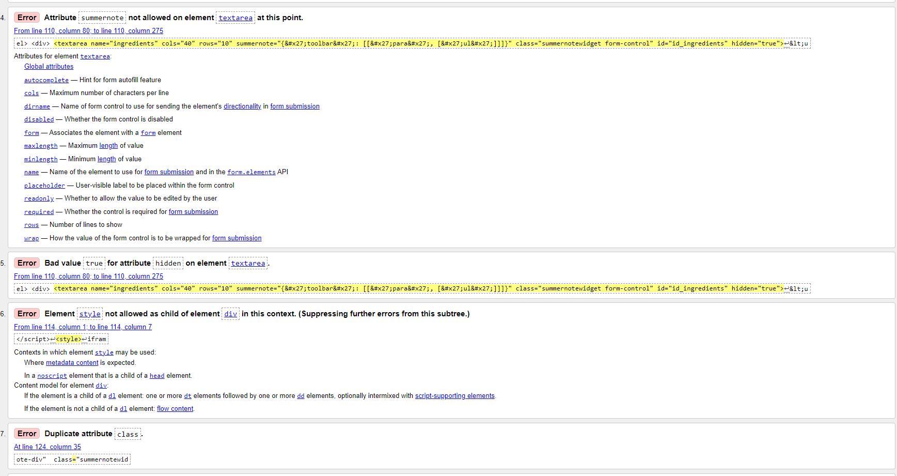

# myKTCN app Testing

## TABLE OF CONTENTS

1) [Manual Testing](#1-manual-testing)
    - 
    - 
    - 
    - 
    - 
    - 
2) [Code Validation](#2-code-validation)
    - [W3C HTML Validation]()
    - [W3C (Jigsaw) CSS Validation]()
    - [JSHint JavaScript Validation]()
    - [CI Python Linter Python Validation]()
3) [Responsiveness testing](TESTING.md/#3-responsiveness-testing)
    - [Homepage responsiveness](TESTING.md/#homepage-responsiveness)
    - [Browse recipes responsiveness](TESTING.md/#homepage-modal-windows-responsiveness)
    - [Cookbook responsiveness](TESTING.md/#quiz-responsiveness)
    - [Recipe form responsiveness](TESTING.md/#signup-page-responsiveness)
    - [Drafts page responsiveness](TESTING.md/#quiz-result-responsiveness)
    - [User account responsiveness](TESTING.md/#dosha-modal-window-responsiveness)
4) [Browser compatibility](TESTING.md/#4-browser-compatibility)
5) [Bugs and fixes](TESTING.md/#5-bugs-and-fixes)
6) [Lighthouse reports](TESTING.md/#6-ligthouse-reports)
7) [User testing](TESTING.md/#7-user-testing)

[⬅ Back to the README.md file](README.md)

- - -
## 1) MANUAL TESTING

- - -

## 2) CODE VALIDATION
### W3C HTML VALIDATION

All html pages have been run through the [W3C HTML Validator](https://validator.w3.org/) and the below results were returned.

| HTML page     | Errors        | Warnings      | See results  |
| ------------- | ------------- |---------------|--------------|
| base.html     | None          | None          | 

base results
  
|
| index.html    | None          | None          |

index results
  
|
| browse_recipes.html    | None          | None          |

browse recipes results
  
|
| cookbook.html    | None          | None          |

cookbook results
  
|
| recipe_create.html    | **Yes**         | None          |

Add recipe results
  
|
| recipe_edit.html    | **Yes**         | None          |

Edit recipe results
  
|
| recipe_confirm_delete.html    | None          | None          |

Delete recipe results
  
|
| recipe_details.html    | None          | None          |

recipe details results
  
|
| drafts.html    | None          | None          |

drafts results
  
|
| 404.html    | None          | None          |

404 page results
  
|
| login.html    | None          | None          |

login results
  
|
| logout.html    | None          | None          |

logout results
  
|
| signup.html    | None          | None          |

signup results
  
|

As indicated in the table, there are two pages that return validation errors: __recipe_create.html__ and __recipe_edit.html__. These errors come from the installed Summernote library, that runs on the ingredients and method input fields in the recipe form. These errors stay __unresolved/cannot be fixed__ since they come from an external source.
- - - 
### Jigsaw CSS VALIDATION

__No errors or warnings__ are returned when passing the styles.css through the [Jigsaw CSS Validator](https://jigsaw.w3.org/css-validator/).

- - -
### JSHint JavaScript VALIDATION

All the sripts used in myKTCN have been run through the [JSHint Javascript Validator](https://jshint.com/) and they return __no errors__.

| Script     | Errors        | See results  |
| ------------- | -------------|--------------|
| carousel     | None          | 

carousel script results
  
|
| messages display     | None          | 

display messages script results
  
|
| rating system     | None          | 

rating system script results
  
|
| select2     | None          | 

select2 script results
  
|

- - -
### CI Python Linter Python VALIDATION

All the main Python files were run through the [CI Python Linter Validator](https://pep8ci.herokuapp.com/) with __no errors__ returned.

| Python file     | Errors        | See results  |
| ------------- | -------------|--------------|
| forms.py     | None          | 

forms.py results
  
|
| models.py     | None          | 

models.py results
  
|
| urls.py     | None          | 

urls.py results
  
|
| views.py     | None          | 

views.py results
  
|